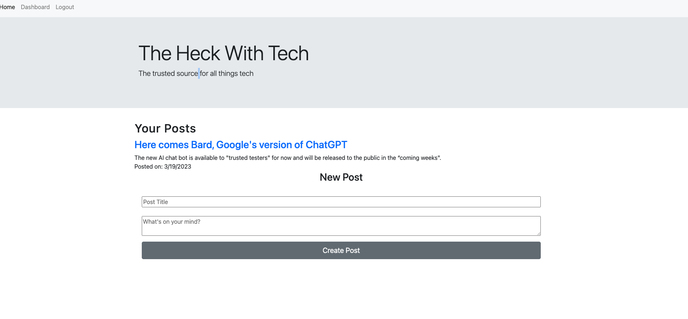

# MVC Tech Blog

## Description

"The Heck With Tech" is an up-to-date blog site for all things tech and web development. This site allows developers to share blog posts, as well as view and comment on other blog posts.

### User Story

---

AS A developer who writes about tech

I WANT a CMS-style blog site

SO THAT I can publish articles, blog posts, and my thoughts and opinions

### What I Learned

---

- Working heavily with Express.js and routing
- Utilizing applications like Postman and Insomnia to test routes
- Setting up a project using the MVC (Model-View-Controller) model
- Deploying an application using Heroku
- Using Handlebars.js for template structure in a project
- Continued database usage with MySQL and Sequelize

## Table of Contents

---

- [Built Using](#built-using)
- [Deployed Application](#deployed-application)
- [Installation](#installation)
- [Usage](#usage)
- [Screenshot](#screenshot)
- [Credits](#credits)
- [License](#license)
- [Questions](#questions)
- [Socials](#socials)

## Built Using

---

         

## Deployed Application

- The application can be viewed via Heroku at: https://the-heck-with-tech.herokuapp.com/

## Installation

- No installation steps are necessary if viewing on the deployed page in Heroku.

- To test locally, you can clone this repo to your device and test in your own code editor and terminal.
  Please make sure Node.js has been installed. In your terminal/command line, run `npm i` or `npm install` to install the Node dependencies found in the `package.json` file.
- If you are connected to MySQL, there is a schema file within the project to help you seed initial data. Run `npm seed` in your terminal to initiate this process.
- Start the server by running `npm run start` to begin and view from your local host port.

## Usage

## License

MIT License

## Questions

Email: [samocain93@gmail.com](mailto:samocain93@gmail.com)

GitHub: [samocain93](https://github.com/samocain93)

## Socials

